<h2>TensorFlow-FlexUNet-Image-Segmentation-Multiclass-Pavement-Defect (2025/11/05)</h2>
<!--
Toshiyuki Arai 
Software Laboratory antillia.com 
 -->
This is the first experiment of Image Segmentation for <b>Multiclass Pavement Defect</b> based on 
our <a href="./src/TensorFlowFlexUNet.py">TensorFlowFlexUNet</a>
 (<b>TensorFlow Flexible UNet Image Segmentation Model for Multiclass</b>)
, and a 512x512 pixels 
Augmented-Pavement-ImageMask-Dataset 
 which was derived by us from   
<a href="https://github.com/FuturePave/PaveSeg-Dataset">
<b>PaveSeg Dataset</b>
</a>
  
<b>Data Augmentation Strategy</b> 
To address the limited size of <b>img_previw</b> and <b>label_preview</b> of the <b>PaveSeg Dataset</b>,
which contains 100 images and labels repectively,

we used our offline augmentation tools <a href="https://github.com/sarah-antillia/Image-Distortion-Tool"> 
Image-Distortion-Tool</a> and
<a href="https://github.com/sarah-antillia/Barrel-Image-Distortion-Tool">Barrel-Image-Distortion-Tool</a> 
 to augment the preview dataset.

 
 

<b>Actual Image Segmentation for Images of 512x512 pixels</b> 
As shown below, the inferred masks predicted by our segmentation model trained on the 
PNG dataset appear similar to the ground truth masks, but this model failed to segment some blue crack regions. 
<b>rgb_map (Crack:blue, Pothole:green, Sealed_crack:red, Patch:pink, Alligator_crack:cyan,
 Utilitity_cover:yellow, Expansion_joint:white)</b> 
 
<table>
<tr>
<th>Input: image</th>
<th>Mask (ground_truth)</th>
<th>Prediction: inferred_mask</th>
</tr>
<tr>
<td>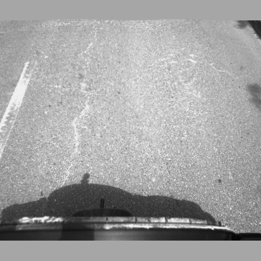</td>
<td></td>
<td></td>
</tr>
</tr>
<td>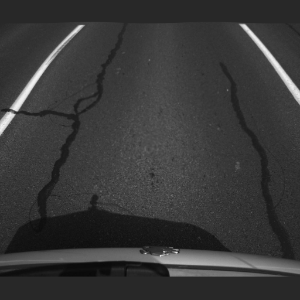</td>
<td>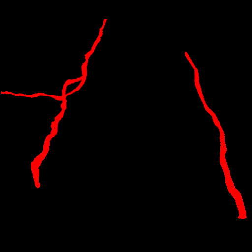</td>
<td>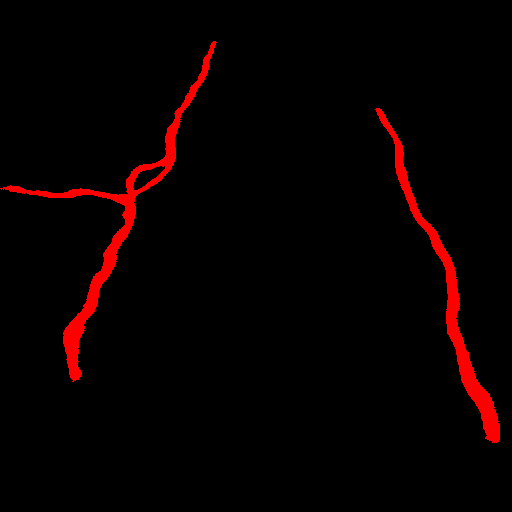</td>
</tr>
<tr>
<td>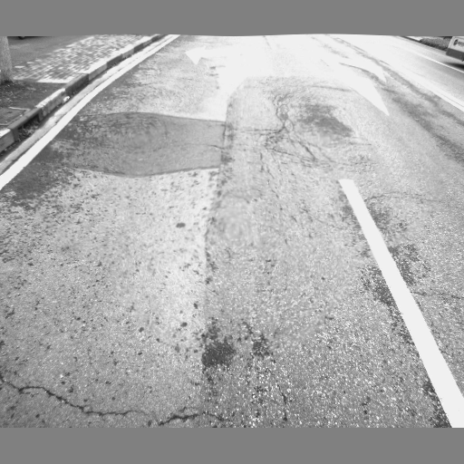</td>
<td>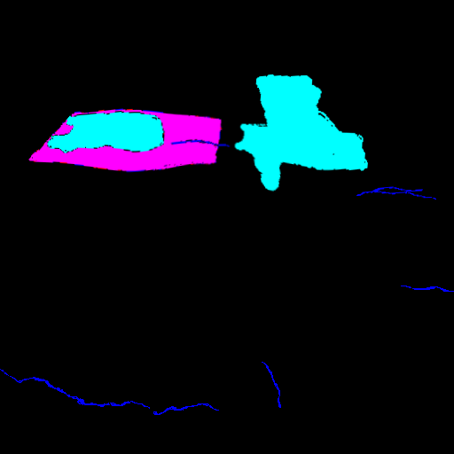</td>
<td>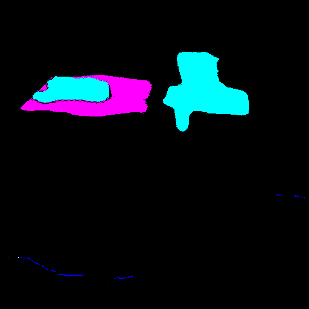</td>
</tr>
</table>

 
<h3>1 Dataset Citation</h3>
The dataset used here was obtained from:
  
<b>img_preview</b> and <b>label_preivew</b> of
<a href="https://github.com/FuturePave/PaveSeg-Dataset">
<b>PaveSeg Dataset</b>
</a>
 
 
The dataset provides a comprehensive collection of annotated images designed for high-precision pavement 
condition recognition through semantic segmentation.  
By focusing on detailed labeling of pavement distresses, it enables the development and evaluation of 
deep learning models aimed at automating the identification and classification of pavement defects. The dataset offers a rich set of high-quality, 
labeled data that supports advancements in automated road monitoring, aiming to pave the way for improved predictive maintenance and
  

<b>Annotations</b> 
Each label in <b>label_preview</b> subset is gray-scaled with the following 7 categories.  
<table <table border="1" style="border-collapse: collapse;">
<tr>
<th>Category ID</th><th>Category Name</th><th>Grayscale Value</th>
</tr>
<tr><td>1</td><td>Crack          </td><td>  30</td></tr>
<tr><td>2</td><td>Pothole        </td><td>  60</td></tr>
<tr><td>3</td><td>Sealed crack   </td><td>  90</td></tr>
<tr><td>4</td><td>Patch          </td><td> 120</td></tr>
<tr><td>5</td><td>Alligator crack</td><td> 150</td></tr>
<tr><td>6</td><td>Utilitity_cover</td><td> 180</td></tr>
<tr><td>7</td><td>Expansion_joint</td><td> 210</td></tr>
<tr><td>0</td><td>Background     </td><td>   0</td></tr>
</table>
 
 
<b>Data Access</b> 
A preview version of the dataset, containing 100 images and their corresponding annotations, 
is available in this repository.  
Anyone can apply for access to the full dataset for non-commercial use by filling out a simple data request form. 
 We will provide the application process for obtaining the complete dataset as soon as possible, in preparation for its public release. 
 Additionally, we are in the process of collecting and annotating more data to meet the demands of future research.
If you use this dataset for academic research, please cite it using the following reference:
 
<b>
[Under Review] Pavement condition sensing for vision-based auton-omous driving based on deep encoder-decoder net-work and spatial attention mechanism
</b>
  

<b>LICENSE</b> 
Unknown
 
 
<h3>
2 Pavement ImageMask Dataset
</h3>
 If you would like to train this Pavement Segmentation model by yourself,
 please generate your own Augmented-Pavement-ImageMask-Dataset by using
 the augmentation tools <a href="https://github.com/sarah-antillia/Image-Distortion-Tool"> 
Image-Distortion-Tool</a> and
<a href="https://github.com/sarah-antillia/Barrel-Image-Distortion-Tool">Barrel-Image-Distortion-Tool</a>,
and put it under <b>dataset</b> folder to be:
<pre>
./dataset
└─Pavement
    ├─test
    │   ├─images
    │   └─masks
    ├─train
    │   ├─images
    │   └─masks
    └─valid
        ├─images
        └─masks
</pre>
<b>Pavement Statistics</b> 
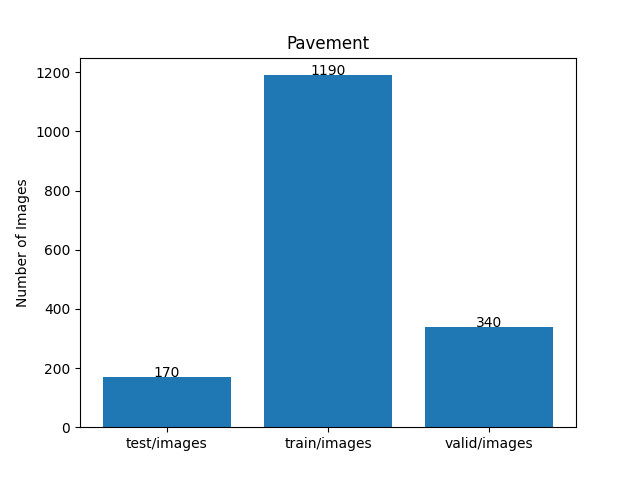 
 
As shown above, the number of images of train and valid datasets is not large to use for a training set of our segmentation model.
  
<b>Mask Colorization</b> 
We used the following <b>Grayscale</b> and <b>RGB</b> color mapping table to generate the multiclass colorized mask.
 
<table <table border="1" style="border-collapse: collapse;">
<tr>
<th>Index</th>
<th>Category</th><th>Grayscale </th><th>Color</th><th>RGB </th>
</tr>
<tr><td>1</td><td>Crack          </td><td>  30</td><td>blue  </td><td>(  0,  0,255)</td></tr>
<tr><td>2</td><td>Pothole        </td><td>  60</td><td>green </td><td>(  0,255,  0)</td></tr>
<tr><td>3</td><td>Sealed crack   </td><td>  90</td><td>red   </td><td>(255,  0,  0)</td></tr>
<tr><td>4</td><td>Patch          </td><td> 120</td><td>pink  </td><td>(255,  0,255)</td></tr>
<tr><td>5</td><td>Alligator crack</td><td> 150</td><td>cyan  </td><td>(  0,255,255)</td></tr>
<tr><td>6</td><td>Utilitity_cover</td><td> 180</td><td>yellow</td><td>(255,255,  0)</td></tr>
<tr><td>7</td><td>Expansion_joint</td><td> 210</td><td>white </td><td>(255,255,255)</td></tr>
</table>

  
<b>Train_images_sample</b> 
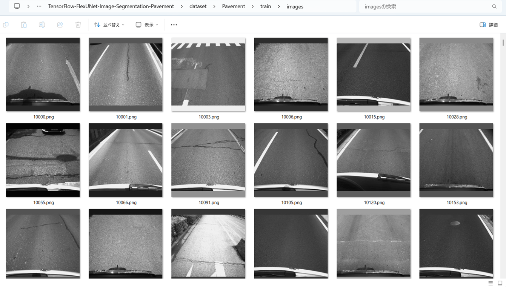
 
<b>Train_masks_sample</b> 
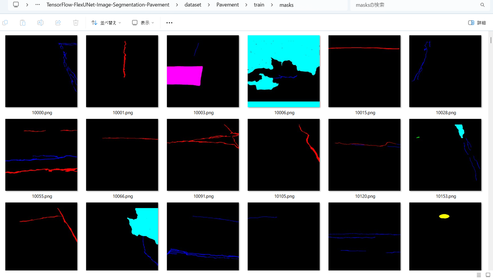
 
 
<h3>
3 Train TensorFlowUNet Model
</h3>
 We trained Pavement TensorFlowFlexUNet Model by using the following
<a href="./projects/TensorFlowFlexUNet/Pavement/train_eval_infer.config"> <b>train_eval_infer.config</b></a> file.  
Please move to ./projects/TensorFlowFlexUNet/Pavement and, and run the following bat file. 
<pre>
>1.train.bat
</pre>
, which simply runs the following command. 
<pre>
>python ../../../src/TensorFlowFlexUNetTrainer.py ./train_eval_infer.config
</pre>

<b>Model parameters</b> 
Defined a small <b>base_filters = 16</b> and large <b>base_kernels = (7,7)</b> for the first Conv Layer of Encoder Block of 
<a href="./src/TensorFlowFlexUNet.py">TensorFlowFlexUNet.py</a> 
and a large num_layers (including a bridge between Encoder and Decoder Blocks).
<pre>
[model]
image_width    = 512
image_height   = 512
image_channels = 3

num_classes    = 2

base_filters   = 16
base_kernels   = (7,7)
num_layers     = 8
dropout_rate   = 0.05
dilation       = (1,1)

</pre>

<b>Learning rate</b> 
Defined a very small learning rate.  
<pre>
[model]
learning_rate  = 0.00007
</pre>

<b>Online augmentation</b> 
Disabled our online augmentation.  
<pre>
[model]
model         = "TensorFlowFlexUNet"
generator     = False
</pre>

<b>Loss and metrics functions</b> 
Specified "categorical_crossentropy" and <a href="./src/dice_coef_multiclass.py">"dice_coef_multiclass"</a>. 
You may specify other loss and metrics function names. 
<pre>
[model]
loss           = "categorical_crossentropy"
metrics        = ["dice_coef_multiclass"]
</pre>
<b>Learning rate reducer callback</b> 
Enabled learing_rate_reducer callback, and a small reducer_patience.
<pre> 
[train]
learning_rate_reducer = True
reducer_factor     = 0.5
reducer_patience   = 4
</pre>

<b>Early stopping callback</b> 
Enabled early stopping callback with patience parameter.
<pre>
[train]
patience      = 10
</pre>

<b>RGB Color map</b> 
rgb color map dict for Pavement 1+1 classes.
<pre>
[mask]
mask_datatype    = "categorized"
mask_file_format = ".png"
;Crack:blue, Pothole:green, Sealed_crack:red, Patch:pink, Alligator_crack:cyan,Utilitity_cover:yellow, Expansion_joint:white
rgb_map = {(0,0,0):0,(0,0,255):1, (0,255,0):2, (255,0,0):3, (255,0,255):4,(0,255,255):5, (255,255,0):6, (255,255,255):7}
</pre>

<b>Epoch change inference callback</b> 
Enabled <a href="./src/EpochChangeInferencer.py">epoch_change_infer callback (EpochChangeInferencer.py)</a></b>. 
<pre>
[train]
epoch_change_infer       = True
epoch_change_infer_dir   =  "./epoch_change_infer"
num_infer_images         = 6
</pre>

By using this callback, on every epoch_change, the inference procedure can be called
 for 6 images in <b>mini_test</b> folder. This will help you confirm how the predicted mask changes 
 at each epoch during your training process.    

<b>Epoch_change_inference output at starting (epoch 1,2,3)</b> 
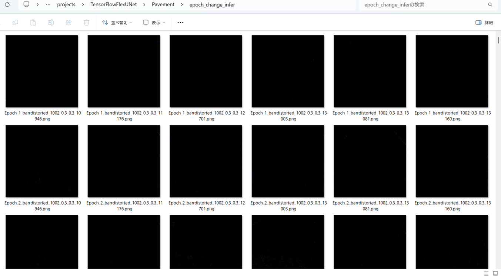 
 
<b>Epoch_change_inference output at middlepoint (epoch 44,45,46)</b> 
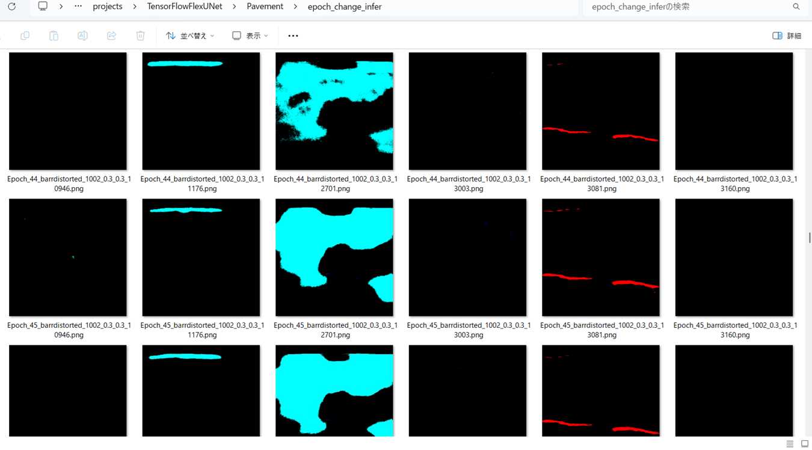 
 

<b>Epoch_change_inference output at ending (epoch 89,90,91)</b> 
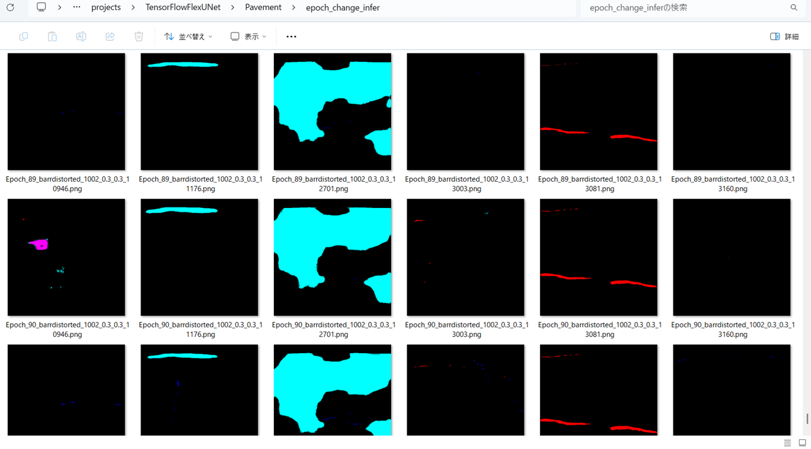 
 

In this experiment, the training process was stopped at epoch 91 by EarlyStopping Callback.  
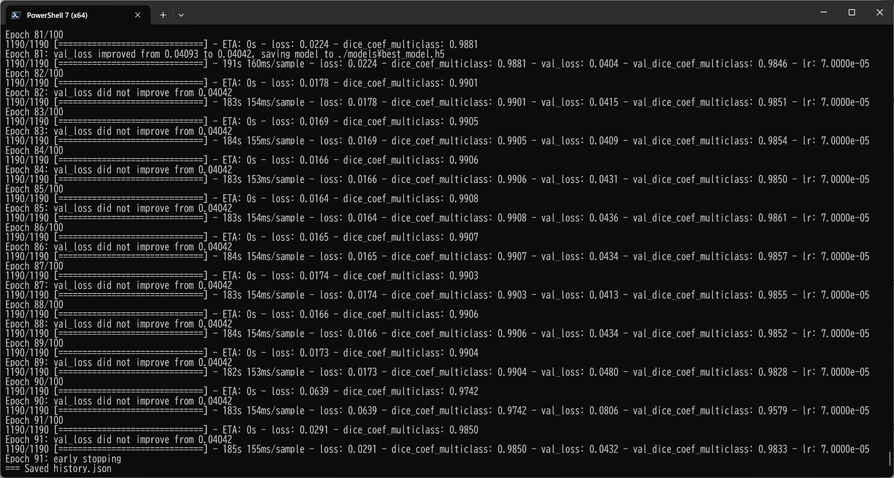 
 

<a href="./projects/TensorFlowFlexUNet/Pavement/eval/train_metrics.csv">train_metrics.csv</a> 
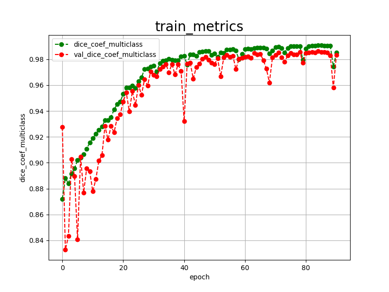 

 
<a href="./projects/TensorFlowFlexUNet/Pavement/eval/train_losses.csv">train_losses.csv</a> 
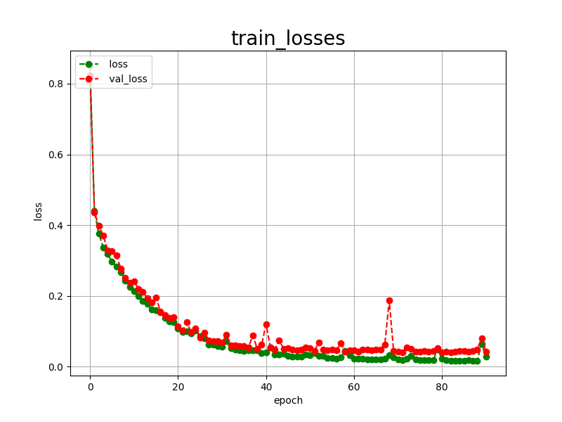 

 

<h3>
4 Evaluation
</h3>
Please move to a <b>./projects/TensorFlowFlexUNet/Pavement</b> folder, 
and run the following bat file to evaluate TensorFlowUNet model for Pavement. 
<pre>
./2.evaluate.bat
</pre>
This bat file simply runs the following command.
<pre>
python ../../../src/TensorFlowFlexUNetEvaluator.py ./train_eval_infer.config
</pre>

Evaluation console output: 
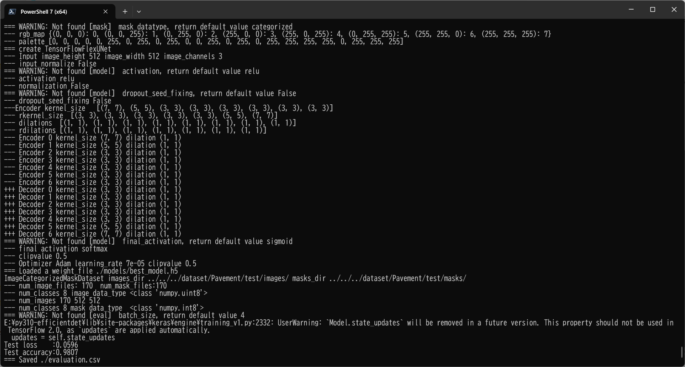
  Image-Segmentation-Pavement

<a href="./projects/TensorFlowFlexUNet/Pavement/evaluation.csv">evaluation.csv</a> 

The loss (bce_dice_loss) to this Pavement/test was not low, and dice_coef not high as shown below.
 
<pre>
categorical_crossentropy,0.0596
dice_coef_multiclass,0.9807
</pre>
 
<h3>
5 Inference
</h3>
Please move to a <b>./projects/TensorFlowFlexUNet/Pavement</b> folder 
,and run the following bat file to infer segmentation regions for images by the Trained-TensorFlowFlexUNet model for Pavement. 
<pre>
./3.infer.bat
</pre>
This simply runs the following command.
<pre>
python ../../../src/TensorFlowFlexUNetInferencer.py ./train_eval_infer.config
</pre>

<b>mini_test_images</b> 
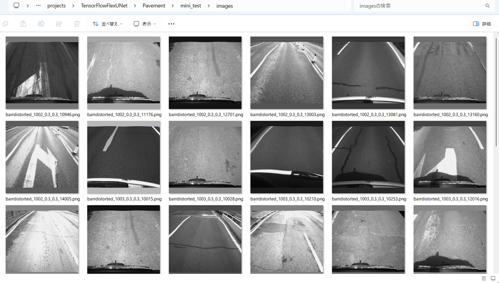 
<b>mini_test_mask(ground_truth)</b> 
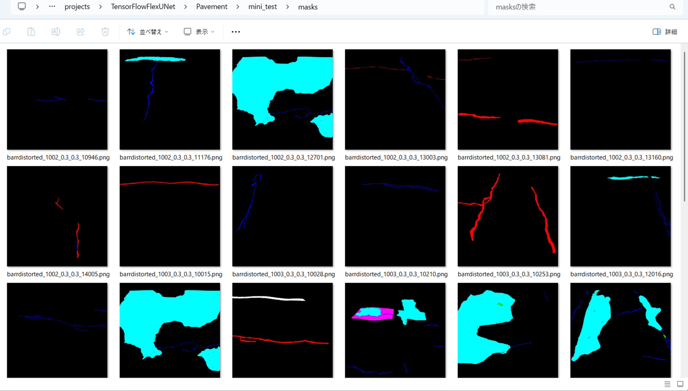 

<b>Inferred test masks</b> 
 
 
 

<b>Enlarged images and masks for Images of 512x512 pixels </b> 
<b>rgb_map (Crack:blue, Pothole:green, Sealed_crack:red, Patch:pink, Alligator_crack:cyan, 
 Utilitity_cover:yellow, Expansion_joint:white)</b>  

<table>
<tr>

<th>Image</th>
<th>Mask (ground_truth)</th>
<th>Inferred-mask</th>
</tr>

<td>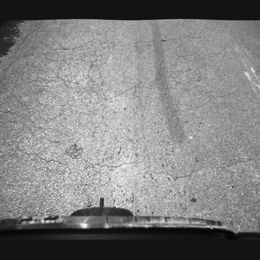</td>
<td>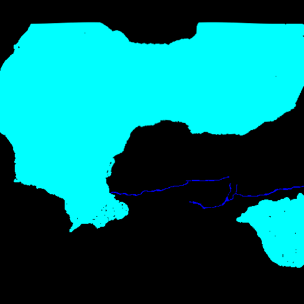</td>
<td>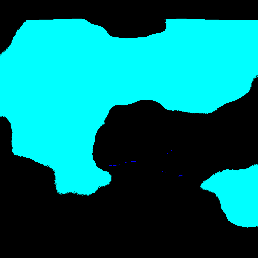</td>
</tr>
<tr>
<td>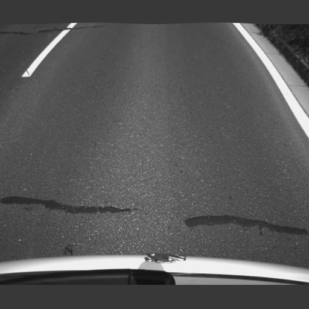</td>
<td>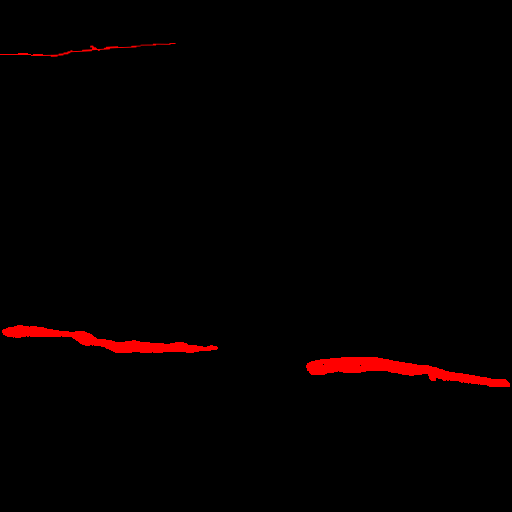</td>
<td>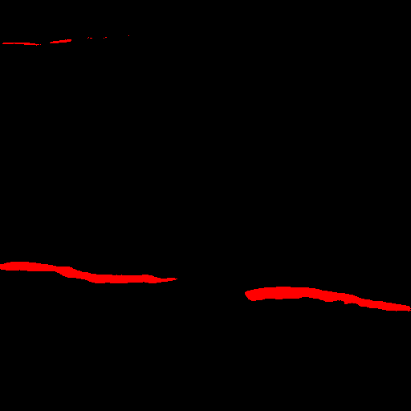</td>
</tr>
<tr>
<td>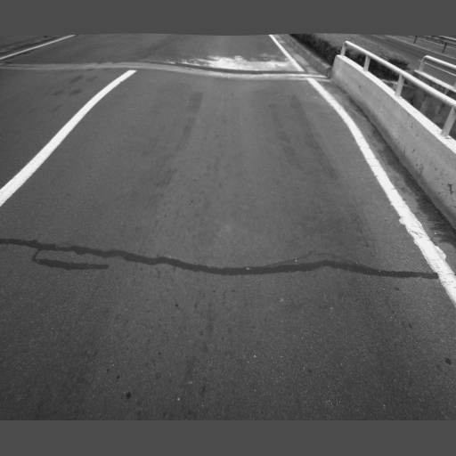</td>
<td>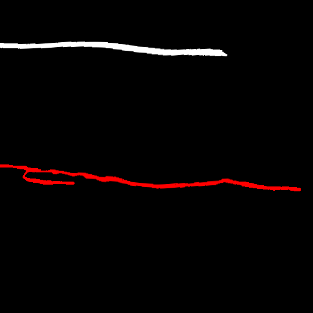</td>
<td>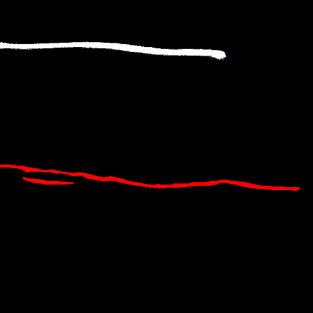</td>
</tr>
<tr>
<td>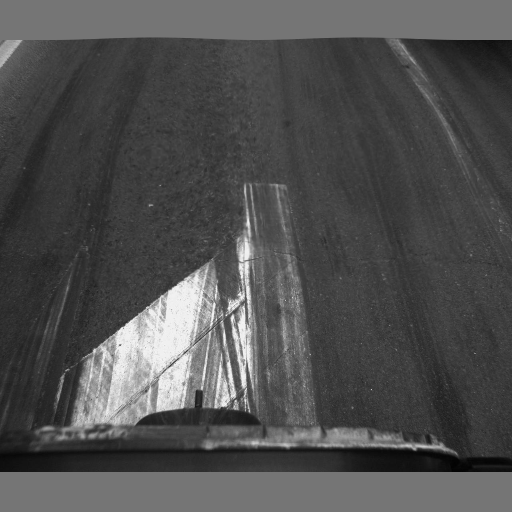</td>
<td></td>
<td></td>
</tr>
<tr>
<td>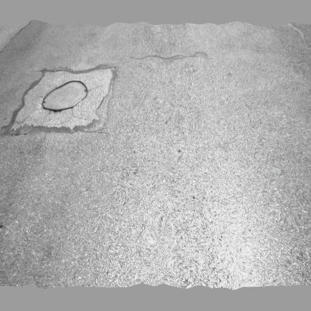</td>
<td>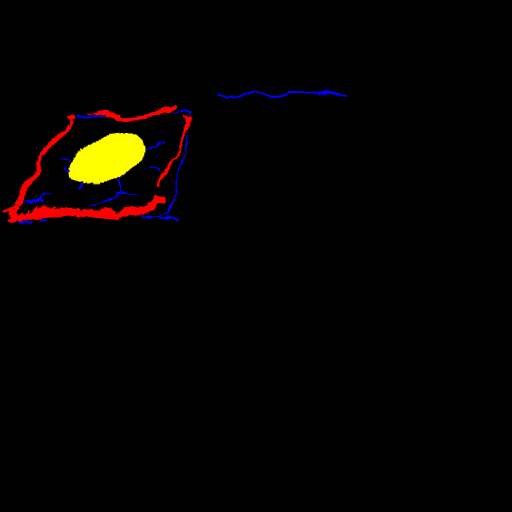</td>
<td></td>
</tr>
<tr>
<td>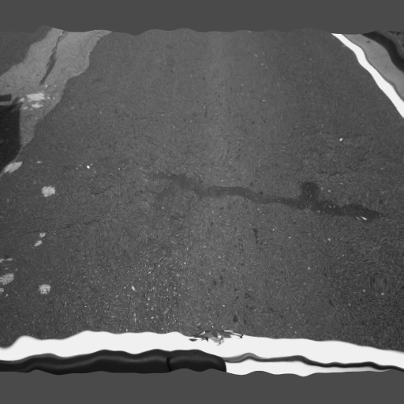</td>
<td>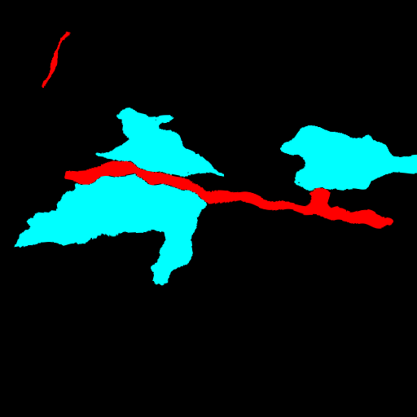</td>
<td>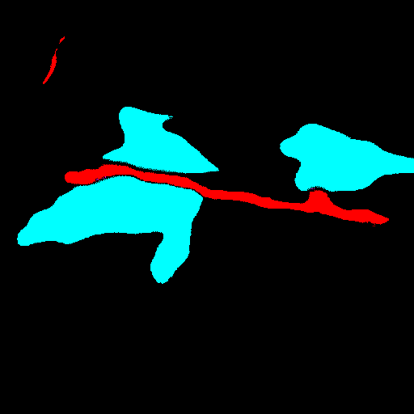</td>
</tr>

<tr>
<td></td>
<td>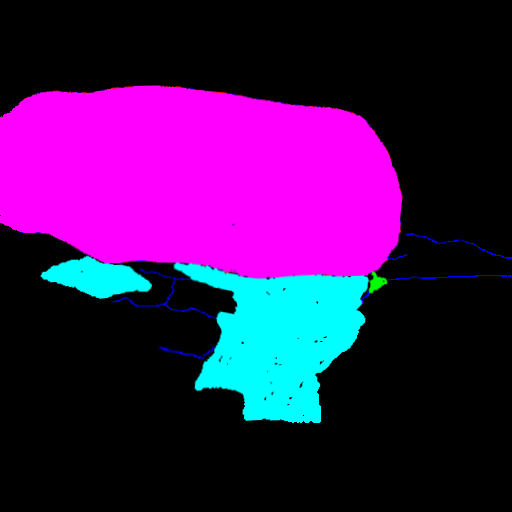</td>
<td>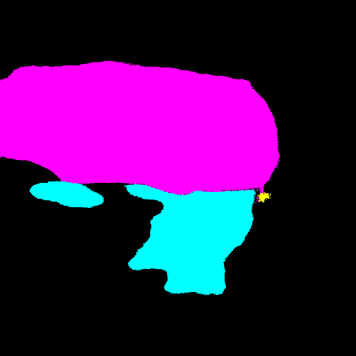</td>
</tr>
</table>

 

<h3>
References
</h3>
<b>1. A REVIEW OF PAVEMENT DEFECT DETECTION BASED ON VISUAL PERCEPTION</b> 
Chenchen Yang, Li Yang, Hailong Duan, Jingwei Deng 
<a href="https://ijomam.com/wp-content/uploads/2024/09/pag.-131-146_A-REVIEW-OF-PAVEMENT-DEFECT-DETECTION-BASED-ON-VISUAL-PERCEPTION.pdf">
https://ijomam.com/wp-content/uploads/2024/09/pag.-131-146_A-REVIEW-OF-PAVEMENT-DEFECT-DETECTION-BASED-ON-VISUAL-PERCEPTION.pdf
</a>
 
 
<b>2. Multi-temporal crack segmentation in concrete structures using deep learning approaches</b> 
Said Harb, Pedro Achanccaray, Mehdi Maboudi, Markus Gerke 
<a href="https://arxiv.org/pdf/2411.04620">https://arxiv.org/pdf/2411.04620</a>
 
 
<b>3. An efficient semantic segmentation method for road crack based on EGA-UNet</b> 
Li Yang, Jingwei Deng, Hailong Duan & Chenchen Yang  
<a href="https://www.nature.com/articles/s41598-025-01983-3">https://www.nature.com/articles/s41598-025-01983-3<</a>
 
 
<b>4. EfficientPavementNet: A Lightweight Model for Pavement Segmentation</b> 
Abid Hasan Zim, Aquib Iqbal, Zaid Al-Huda, Asad Malik, Minoru Kuribayash 
<a href="https://arxiv.org/pdf/2409.18099">https://arxiv.org/pdf/2409.18099</a>
 
 
<b>5. Fine-grained crack segmentation for high-resolution images via a multiscale cascaded network</b> 
Honghu Chu, Pang-jo Chun 
<a href="https://onlinelibrary.wiley.com/doi/full/10.1111/mice.13111">https://onlinelibrary.wiley.com/doi/full/10.1111/mice.13111</a>
 
 
<b>6. TensorFlow-FlexUNet-Image-Segmentation-Model</b> 
Toshiyuki Arai antillia.com  
<a href="https://github.com/sarah-antillia/TensorFlow-FlexUNet-Image-Segmentation-Model">
https://github.com/sarah-antillia/TensorFlow-FlexUNet-Image-Segmentation-Model
</a>
 
 

